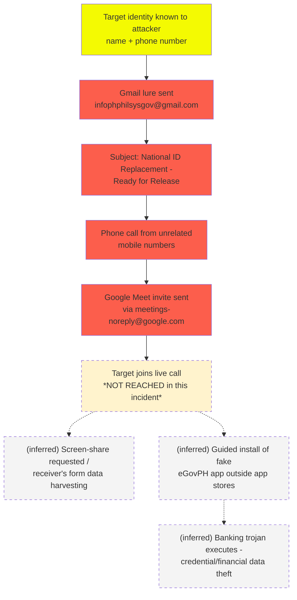

# Attack Flow Diagram

```mermaid
flowchart TD
    A[Target identity known to attacker<br/>name + phone number] --> B[Gmail lure sent<br/>infophphilsysgov@gmail.com]
    B --> C["Subject: National ID Replacement -<br/>Ready for Release"]
    C --> D[Phone call from unrelated<br/>mobile numbers]
    D --> E[Google Meet invite sent<br/>via meetings-noreply@google.com]
    E --> F[Target joins live call<br/>*NOT REACHED in this incident*]
    F -.-> G["(inferred) Screen-share requested /<br/>receiver's form data harvesting"]
    F -.-> H["(inferred) Guided install of fake<br/>eGovPH app outside app stores"]
    H -.-> I["(inferred) Banking trojan executes -<br/>credential/financial data theft"]

    style A fill:#F4FA02
    style B fill:#FC5E4C
    style C fill:#FC5E4C
    style D fill:#FC5E4C
    style E fill:#FC5E4C
    style F fill:#fff3cd,stroke-dasharray: 5 5
    style G fill:#f4f4f4,stroke-dasharray: 5 5
    style H fill:#f4f4f4,stroke-dasharray: 5 5
    style I fill:#f4f4f4,stroke-dasharray: 5 5
```
